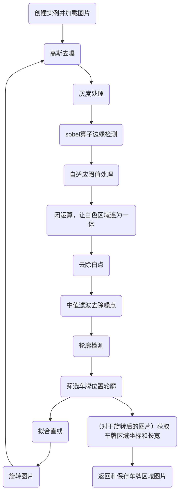

# README

This project is used for graduation design, and is for license plate recognition.

此项目用于我的毕设，主要用于车牌识别（电动车车牌识别系统）。

## 项目目录

本项目主要目录如下：

```text
project/
	|- attachments/
	|- resources/
	|- source/
	|- templates/
	|- test/
	|- main.py
	|- README.md
```

- atatchments：主要用于存放程序产生的数据；
- resources：主要用于存放程序需要的其他资源；
- source：用于存放除了程序入口外的其他程序；
- templates：用于存放模板匹配时用到的模板；
- test：用于存放测试文件（主要是jupyter文件）；
- main.py：程序启动入口；
- README.md：说明性文件，即本文件。

## 模块说明

### PlateLocator

该模块主要用于定位车牌，使用时需要首先创建一个实例：

```python
original_image = cv2.imread('original_path')
plate_locator = PlateLocator(original_image)
```

然后调用函数：

```python
plate_locator.locate_plate()
```

即可将车牌部分图片保存到指定目录。

---

PlateLocator的实现流程主要如下：



